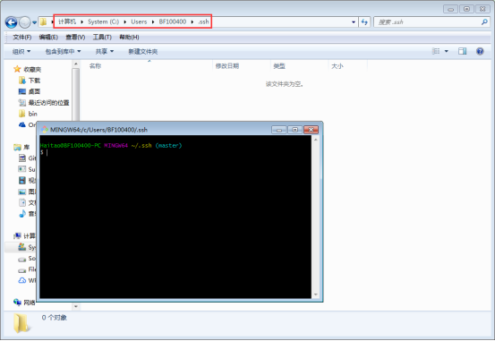
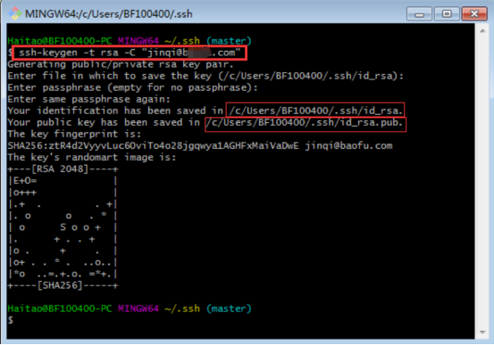
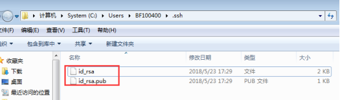
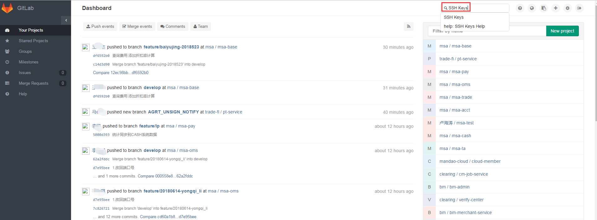
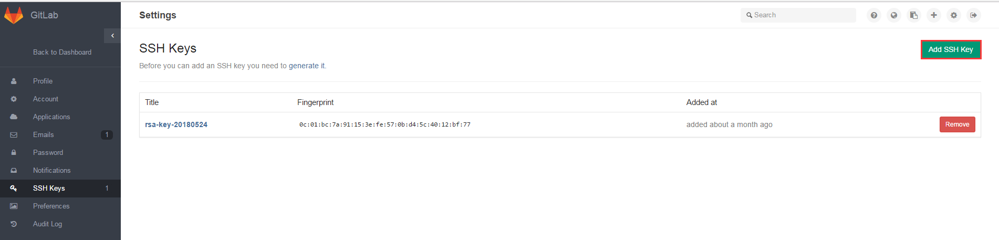
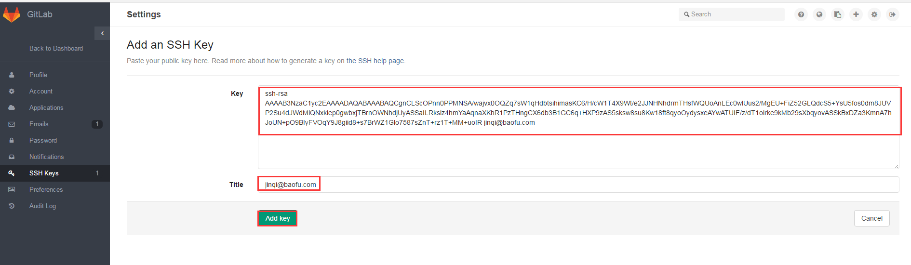
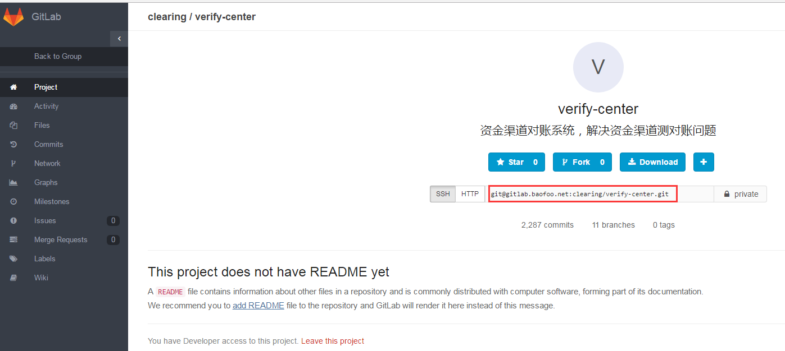
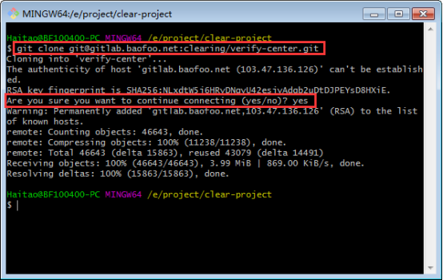
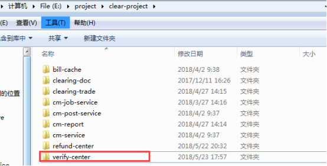

## 1 Git生成秘钥

 

### 1.1 确认本地秘钥

 

SSH 秘钥默认储存在账户的主目录下的 ~/.ssh 目录

如：C:\Users\BF100400\.ssh\

查看是否包含id_rsa和id_rsa.pub(或者是id_dsa和id_dsa.pub之类成对的文件)，有.pub 后缀的文件就是公钥，另一个文件则是密钥。

如果有这两个文件，则跳过1.2；如果没有这两个文件，甚至.ssh目录也没有，则需要用ssh-keygen 来创建

 

### 1.2 生成秘钥信息

- 在.ssh 目录下右键打开Git Bash(.ssh目录不存在，手动创建)

- 生成秘钥：ssh-keygen -t rsa -C "your_email@youremail.com" ，直接Enter就行，然后会提示输入密码(可输可不输)

　　   **说明**：命令中的email，就是gitlab中的账号，需要保持一致

- 执行完成之后，在.ssh 目录下就会生成秘钥文件

## 2 gitlab秘钥添加

笔者当前所在公司使用的gitlab作为代码管理仓库平台，所以下面是gitlab为例说明如何进行秘钥添加，如果个人研究或学习使用的是github，方法同下

 

### 2.1登录gitlab

使用申请的gitlab账号登录

确保登录成功

 

### 2.2 添加秘钥

- 在搜索框中搜索：SSH Keys

- 点击 Add SSH Keys

- 拷贝公钥文件(即1.2中生成的id_rsa.pub)中的信息到key输入框中，title可以随便起，见名知意即可。然后点击Add Keys

## 3 Git示例

 

注意：克隆代码之前确保有相关的项目代码权限(master、developer、reporter)，如无权限，请求项目具有master权限的同事帮忙分配权限

 

- 这里以verify-center项目为例(有相关权限的项目，登录gitlab后，首页右侧会全部以列表形式展示)，点击verify-center获取SSH 链接地址

 

- 在本地目标下载目录下，右键-->Git Bash Here
- 输入命令：git clone git@gitlab.baofoo.net:clearing/verify-center.git
- 首次拉取代码时，需要确认秘钥信息，输入yes即可

 

- 确认项目已从gitlab上克隆到本地

 

 

项目拉取完成，可以打开使用了

原文地址：

https://www.cnblogs.com/xiuxingzhe/p/9303278.html

