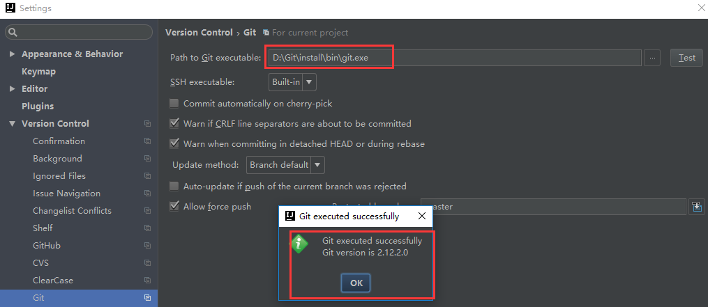

廖雪峰的 git 网址：

- https://www.liaoxuefeng.com/wiki/0013739516305929606dd18361248578c67b8067c8c017b000


### 在Windows上安装Git

在Windows上使用Git，可以从Git官网直接[下载安装程序](https://git-scm.com/downloads)，（网速慢的同学请移步[国内镜像](https://pan.baidu.com/s/1kU5OCOB#list/path=%2Fpub%2Fgit)），然后按默认选项安装即可。

安装完成后，在开始菜单里找到“Git”->“Git Bash”，蹦出一个类似命令行窗口的东西，就说明Git安装成功！


安装完成后，还需要最后一步设置，在命令行输入：

```
$ git config --global user.name "Darian"
$ git config --global user.email "xxxxx@qq.com"
```

因为Git是分布式版本控制系统，所以，每个机器都必须自报家门：你的名字和Email地址。你也许会担心，如果有人故意冒充别人怎么办？这个不必担心，首先我们相信大家都是善良无知的群众，其次，真的有冒充的也是有办法可查的。

注意`git config`命令的`--global`参数，用了这个参数，表示你这台机器上所有的Git仓库都会使用这个配置，当然也可以对某个仓库指定不同的用户名和Email地址。


4.在IDEA中设置Git，在File-->Setting->Version Control-->Git-->Path to Git executable选择你的git安装后的git.exe文件，然后点击Test，测试是否设置成功


