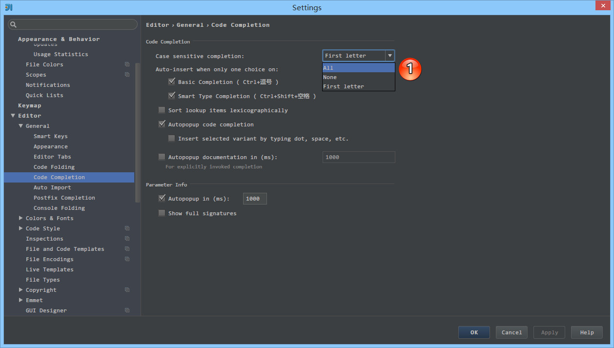
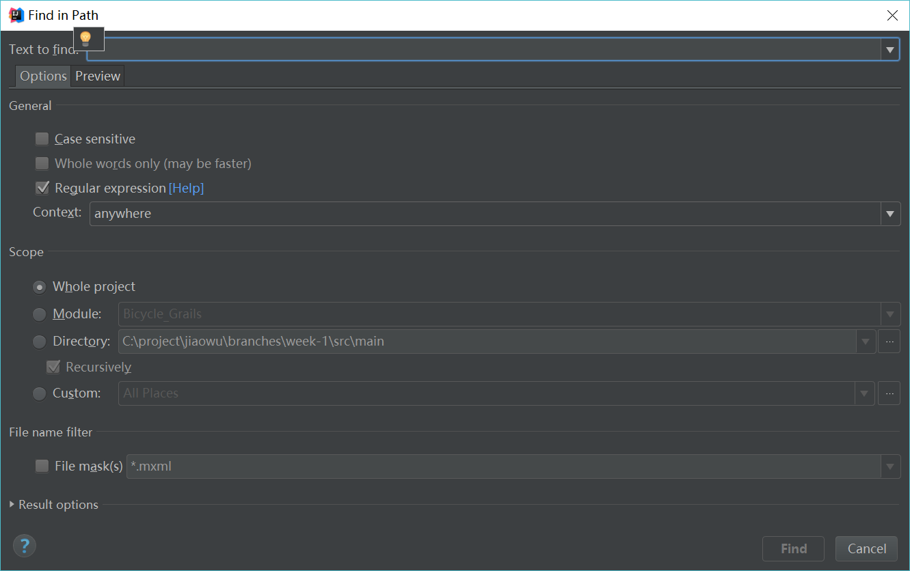

### 代码补全取消区分大小写

- IntelliJ IDEA 的代码提示和补充功能有一个特性：区分大小写。如上图标注 1 所示，默认就是 First letter 区分大小写的。
- 区分大小写的情况是这样的：比如我们在 Java 代码文件中输入 stringBuffer IntelliJ IDEA 是不会帮我们提示或是代码补充的，但是如果我们输入 StringBuffer 就可以进行代码提示和补充。
- 如果想不区分大小写的话，改为 None 选项即可。

### 拼写检查

- 如上图 Gif 所示，该功能用来快速设置代码检查等级。我个人一般在编辑大文件的时候会使用该功能。IntelliJ IDEA 对于编辑大文件并没有太大优势，很卡，原因就是它有各种检查，这样是非常耗内存和 CPU 的，所以为了能加快大文件的读写，我一般会暂时性设置为 None。
  - Inspections 为最高等级检查，可以检查单词拼写，语法错误，变量使用，方法之间调用等。
  - Syntax 可以检查单词拼写，简单语法错误。
  - None 不设置检查

### 自动导包

- 如上图标注 1 和 2 所示，默认 IntelliJ IDEA 是没有开启自动 import 包的功能。
  - 勾选标注 1 选项，IntelliJ IDEA 将在我们书写代码的时候自动帮我们优化导入的包，比如自动去掉一些没	有用到的包。
  - 勾选标注 2 选项，IntelliJ IDEA 将在我们书写代码的时候自动帮我们导入需要用到的包。但是对于那些同名的包，还是需要手动 Alt + Enter 进行导入的，IntelliJ IDEA 目前还无法智###JAVA导包超过指定数量

如上图标注 1 所示，当我们 Java 类中导入的某个包下类超过这里设置的指定个数，就会换成用 * 号来代替。

### 省电模式

如上图标注 1 所示，IntelliJ IDEA 有一种叫做 省电模式 的状态，开启这种模式之后 IntelliJ IDEA 会关掉代码检查和代码提示等功能。所以一般我也会认为这是一种 阅读模式，如果你在开发过程中遇到突然代码文件不能进行检查和提示可以来看看这里是否有开启该功能。

### 打开文件指定行

- 如上图 Gif 所示，在我们按 Ctrl + Shift + N 进行打开某个文件的时候，我们可以直接定位到改文件的行数上。一般我们在调 CSS，根据控制台找空指针异常的时候，使用该方法速度都会相对高一点。

### 代码折叠设置

- 如上图标注红圈所示，我们可以对指定代码类型进行默认折叠或是展开的设置，勾选上的表示该类型的代码在文件被打开的时候默认是被折叠的，去掉勾选则反之。

### 代码垂直或水平分组

- 如上图 Gif 所示，IntelliJ IDEA 支持对代码进行垂直或是水平分组。一般在对大文件进行修改的时候，有些修改内容在文件上面，有些内容在文件下面，如果来回操作可能效率会很低，用此方法就可以好很多。当然了，前提是自己的浏览器分辨率要足够高。

### 窗口移动

- 如上图 Gif 所示，我们可以对组件窗口的子窗口进行拖动移位，有时候设置过头或是效果不满意，那我们需要点击此按钮进行窗口还原。

### 打开文件名取消隐藏

- 如上图标注 1 所示，在打开很多文件的时候，IntelliJ IDEA 默认是把所有打开的文件名 Tab 单行显示的。但是我个人现在的习惯是使用多行，多行效率比单行高，因为单行会隐藏超过界面部分 Tab，这样找文件不方便。

### 设置打开项目方式

- *如上图标注 1 所示，勾选此选项后，启动 IntelliJ IDEA 的时候，默认会打开上次使用的项目。如果你只有一个项目的话，该功能还是很好用的，但是如果你有多个项目的话，建议还是关闭，这样启动 IntelliJ IDEA 的时候可以选择最近打开的某个项目。
- 如上图红圈所示，该选项是设置当我们已经打开一个项目窗口的时候，再打开一个项目窗口的时候是选择怎样的打开方式。
  - Open project in new window 每次都使用新窗口打开。
  - Open project in the same window 每次都替换当前已打开的项目，这样桌面上就只有一个项目窗口。
  - Confirm window to open project in 每次都弹出提示窗口，让我们选择用新窗口打开或是替换当前项目窗口。

### 软分行

- 如上图 Gif 所示，对于横向太长的代码我们可以进行软分行查看。软分行引起的分行效果是 IntelliJ IDEA 设置的，本质代码是没有真的分行的。

### 属性窗口取消自动隐藏

- 如上图 Gif 所示，当我们设置了组件窗口的 Pinned Mode 属性之后，在切换到其他组件窗口的时候，已设置该属性的窗口不会自动隐藏。

### 定位文件在project的位置

如上图 Gif 所示，我们可以通过 Alt + F1 + 1 快捷键来定位当前文件所在 Project 组件窗口中的位置。

### 字体大小

- 如上图 Gif 所示，我们可以勾选此设置后，增加 Ctrl + 鼠标滚轮 快捷键来控制代码字体大小显示。

### 显示行数和方法线

- 如上图红圈所示，默认 IntelliJ IDEA 是没有勾选 Show line numbers 显示行数的，但是我建议一般这个要勾选上。
- 如上图红圈所示，默认 IntelliJ IDEA 是没有勾选 Show method separators 显示方法线的，这种线有助于我们区分开方法，所以也是建议勾选上的。

### 自定义代码区域

- 如上图 Gif 所示，我们选中要被折叠的代码按 Ctrl + Alt + T 快捷键，选择自定义折叠代码区域功能。

### 本地文件历史纪录

- 如上图 Gif 所示，即使我们项目没有使用版本控制功能，IntelliJ IDEA 也给我们提供了本地文件历史记录。除了简单的记录之外，我们还可以给当前版本加标签。

### 模拟请求

如上图 Gif 所示，IntelliJ IDEA 自带模拟请求工具 Rest Client，在开发时用来模拟请求是非常好用的。

### 编码修改

如果项目中properties文件使用了ascii编码则需要做如下勾选

### 全局搜索

项目中全局搜索默认快捷键是ctrl+shift+f，在windows下可能会与系统输入法快捷键冲突，如果使用系统输入法，需要自行修改快捷键。

