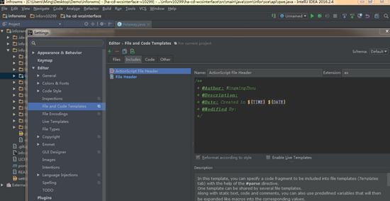
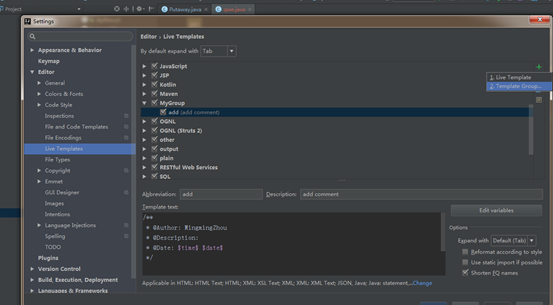
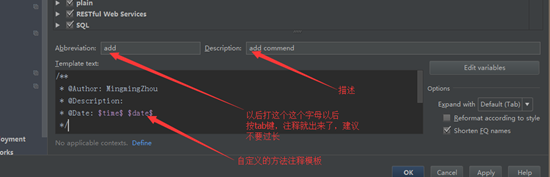
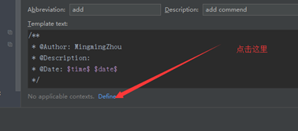
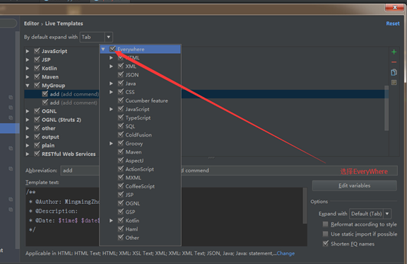
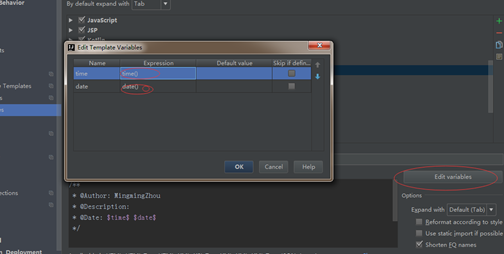
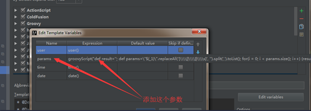
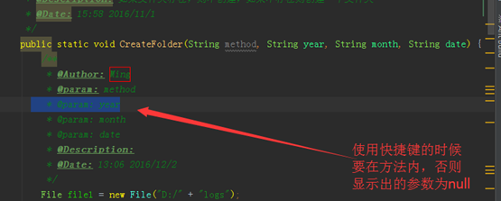

**

详细：****idea如何设置类头注释和方法注释**

**idea:**

**类头注释**：打开

- file

  - setting

    - Editor
      - Filr and Code Templates
        - Includes
          - File Header 

    



-  直接在右边的文件框里编辑你说需要注释的东西，然后应用保存之后,当你创建类的时候就会自动生成注释。

**方法注释**：打开

- file
  - setting
    - Editor
      - File and code Templates
      - 点击右边上面那个绿色的+号，选择Template Group双击，然后弹出一个窗口，随便添加一个名字，我这里添加的是MyGroup然后点击OK 
         



还是在file->setting->Editor->LiveTemplates这个路径下点击一下刚刚你添加的那个名字（Darian的分组为：DarianDefined），然后点击右边上面那个绿色的+号，选择LiveTemplate双击，填写下面的图上的框 

userDefined


 然后点击

 
 然后选择Everywhere 




```java
**     
 * <br>方法说明 :     
 * <br>传入参数：     
 * <br>返回值：     
 * <br>作者：Darian    
 **/        
```


 

​           **     * <br>方法说明 :     * <br>传入参数：     * <br>返回值：     * <br>作者：Darian     **/               

 

最后点击右下角的Edit variables 按钮，然后弹出一个窗口，如下： 



 如果想把 @param：每一个参数可以这样 
 


 参数值要自己写的

groovyScript("def result=''; def params=\"*$**{**_1**}\"**.replaceAll('**[\\\\[**|**\\\\]**|**\\\\**s**]**', '').split(',').toList(); for(i = 0; i < params.size(); i++)* *{**result+=' \* @param ' + params**[**i**]* *+ ((i < params.size() - 1) ? '**\\**n**\\**b' : '')**}**; return result", methodParameters())*  

·        1

把这个添加进去，但是还要注意一点： 





 下面红色圈中的下拉框选择相对应的参数点击OK 
 再点击apply,点击Ok。 
 然后写方法之前点写上add（刚刚填的）按tab，注释就出来了。

 ****