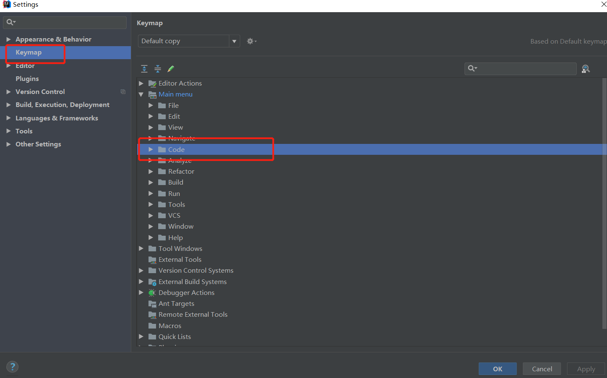
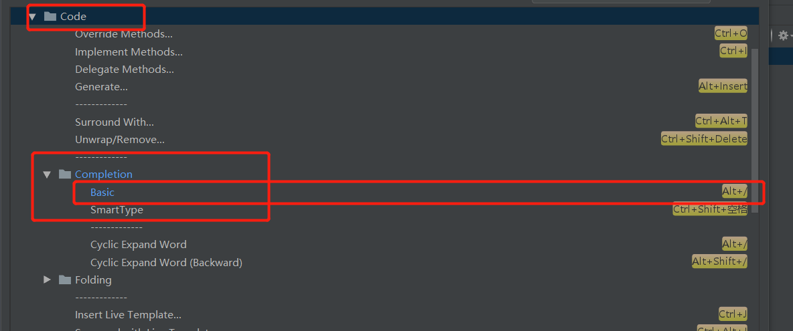

## 

点击 文件菜单(File) –> 点击 设置(Settings… Ctrl+Alt+S), –> 打开设置对话框。
在左侧的导航框中点击 KeyMap。 
接着在右边的树型框中选择 Main menu –> Code –> Completion. 
接着需要做两件事：

1. 移除原来的Cycle Expand Word 的 Alt+/ 快捷键绑定。 
2. 在 Basic 上点击右键,去除原来的 Ctrl+空格 绑定,然后添加 Alt+/ 快捷键。
  然后应用(Apply), OK.

