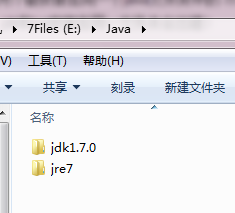
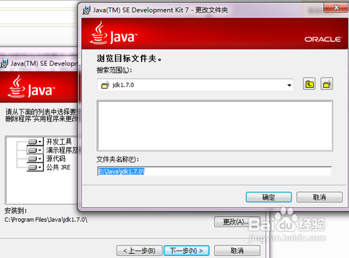
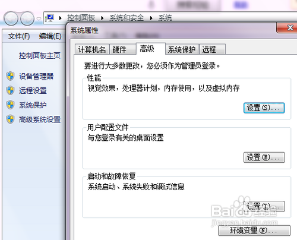

#### 下载地址

oracle JDK8：

- https://www.oracle.com/technetwork/java/javase/downloads/jdk8-downloads-2133151.html

## 方法/步骤

1. 

   安装JDK 选择安装目录 安装过程中会出现两次 安装提示 。第一次是安装 jdk ，第二次是安装 jre 。建议两个都安装在同一个java文件夹中的不同文件夹中。（不能都安装在java文件夹的根目录下，jdk和jre安装在同一文件夹会出错）

   如下图所示

   

2. 

   1：安装jdk 随意选择目录 只需把默认安装目录 \java 之前的目录修改即可

   2：安装jre→更改→ \java 之前目录和安装 jdk 目录相同即可

   注：若无安装目录要求，可全默认设置。无需做任何修改，两次均直接点下一步。

   

   

   

3. 

   安装完JDK后配置环境变量  计算机→属性→高级系统设置→高级→环境变量

   

4. 

   系统变量→新建 JAVA_HOME 变量 。

   变量值填写jdk的安装目录（本人是 E:\Java\jdk1.7.0)

5. 

   系统变量→寻找 Path 变量→编辑

   在变量值最后输入 %JAVA_HOME%\bin;%JAVA_HOME%\jre\bin;

   （注意原来Path的变量值末尾有没有;号，如果没有，先输入；号再输入上面的代码）

   

   

6. 

   系统变量→新建 CLASSPATH 变量

   变量值填写   .;%JAVA_HOME%\lib;%JAVA_HOME%\lib\tools.jar（注意最前面有一点）

   系统变量配置完毕

   

   检验是否配置成功 运行cmd 输入 java -version （java 和 -version 之间有空格）

   

   若如图所示 显示版本信息 则说明安装和配置成功。

   