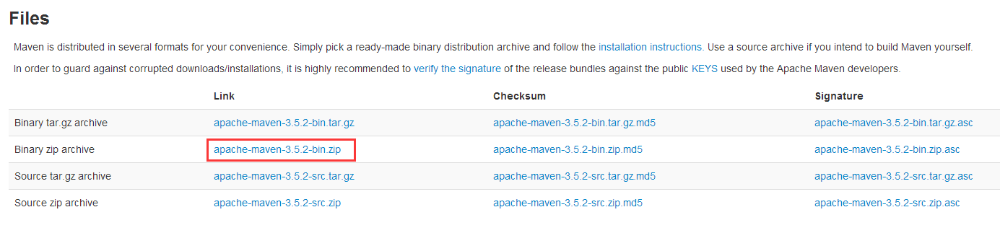
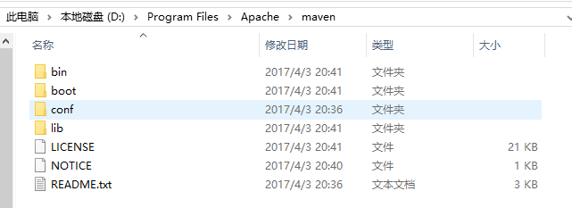
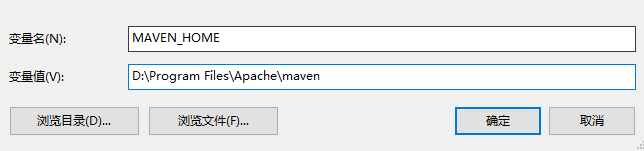
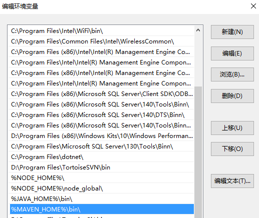
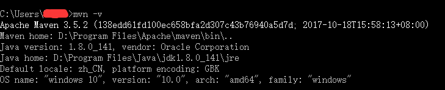
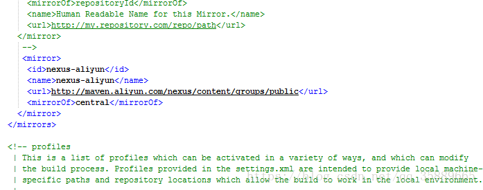
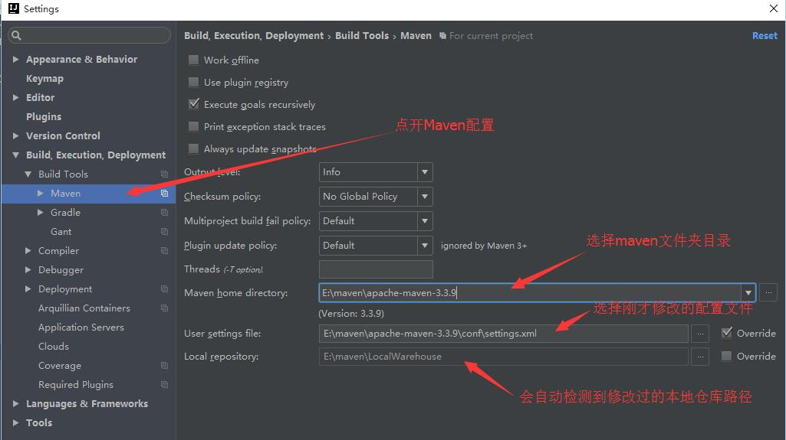

二、下载与安装

\1. 前往<https://maven.apache.org/download.cgi>下载最新版的Maven程序：



\2. 将文件解压到D:\Program Files\Apache\maven目录下:



\3. 新建环境变量MAVEN_HOME，赋值D:\Program Files\Apache\maven



\4. 编辑环境变量Path，追加%MAVEN_HOME%\bin\;



\5. 至此，maven已经完成了安装，我们可以通过DOS命令检查一下我们是否安装成功：

```
mvn -v
```



三、配置Maven本地仓库

1. 在D:\Program Files\Apache\目录下新建maven-repository文件夹，该目录用作maven的本地库。
2. Maven会将下载的类库（jar包）放置到本地的一个目录下，如果想重新定义这个目录的位置就需要修改Maven本地仓库的配置：

修改文件：D:\maven\apache-maven-3.2.3\conf\setting.xml

```xml
<settings xmlns="http://maven.apache.org/SETTINGS/1.0.0" 
              xmlns:xsi="http://www.w3.org/2001/XMLSchema-instance" 
              xsi:schemaLocation="http://maven.apache.org/SETTINGS/1.0.0 http://maven.apache.org/xsd/settings-1.0.0.xsd">
      <!-- localRepository
       | The path to the local repository maven will use to store artifacts.
       |
       | Default: ${user.home}/.m2/repository
      <localRepository>/path/to/local/repo</localRepository>
      -->
        <localRepository>D:\maven\repository</localRepository>

</settings>
```

localRepository节点默认是被注释掉的，需要把它移到注释之外，然后将localRepository节点的值改为我们在3.1中创建的目录D:\Program Files\Apache\maven-repository。

3. localRepository节点用于配置本地仓库，本地仓库其实起到了一个缓存的作用，它的默认地址是 C:\Users\用户名.m2。

当我们从maven中获取jar包的时候，maven首先会在本地仓库中查找，如果本地仓库有则返回；如果没有则从远程仓库中获取包，并在本地库中保存。

此外，我们在maven项目中运行mvn install，项目将会自动打包并安装到本地仓库中。

4. 运行一下DOS命令

```c
mvn help:system
```

如果前面的配置成功，那么D:\Program Files\Apache\maven-repository会出现一些文件。


更改 仓库：





 具体代码：

```xml
 <mirror>      
      <id>nexus-aliyun</id>    
      <name>nexus-aliyun</name>  
      <url>http://maven.aliyun.com/nexus/content/groups/public</url>    
      <mirrorOf>central</mirrorOf>      
    </mirror> 
  </mirrors>
```


这些弄完后最重要的一步，就是将这个文件复制粘贴到.m2目录下，大功告成

后面就是验证是否安装成功：

mvn -v


##### Idea 配置 maven


